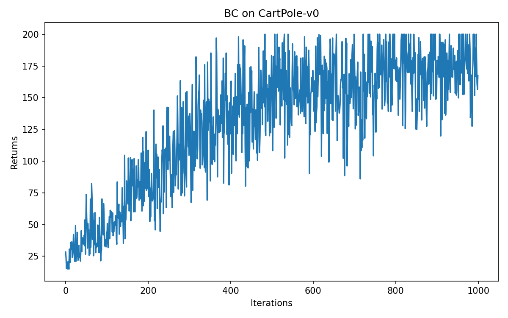
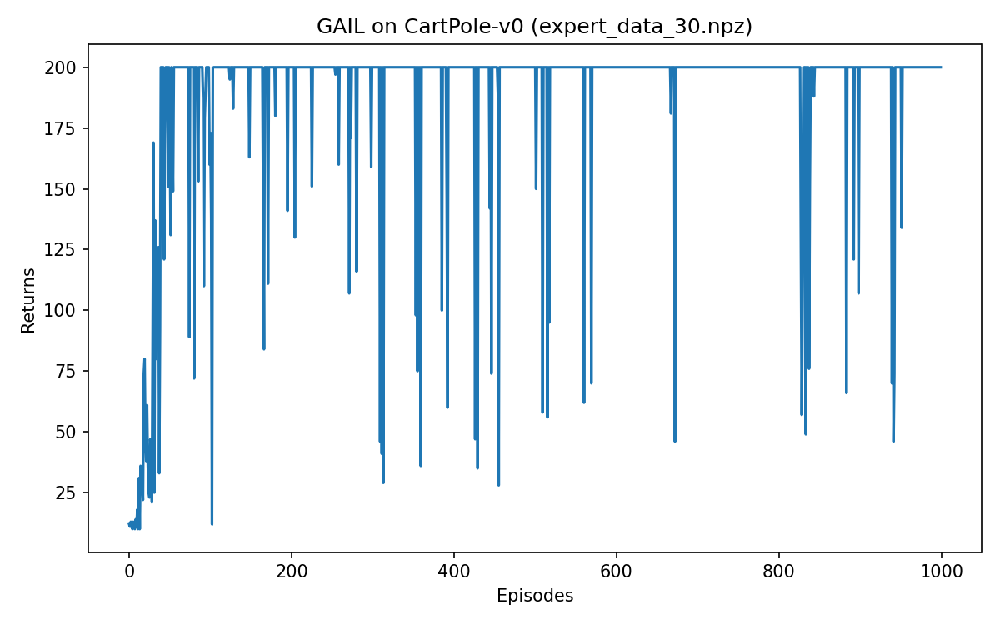

# Imitation Learning Implementations

<div align="center">
  
</div>

## Quick Start

### Clone the Repository

```bash
git clone https://github.com/xiaoshengdianzi/BC_GAIL_Project.git
cd BC_GAIL_Project
```

### Install Dependencies

```bash
pip install torch numpy tqdm matplotlib gymnasium
```

If you use gym (older installs), replace gymnasium with gym.

## Overview

This repository provides a comprehensive implementation of various imitation learning algorithms in PyTorch, including Behavioral Cloning (BC) and Generative Adversarial Imitation Learning (GAIL). It also includes expert policy training using Proximal Policy Optimization (PPO) to generate high-quality demonstration data.

The project is designed to serve as both an educational resource and a practical implementation for researchers and practitioners interested in imitation learning techniques.

## Table of Contents

- [Quick Start](#quick-start)
- [Overview](#overview)
- [Environment Requirements](#environment-requirements)
- [Installation](#installation)
- [Training Guide](#training-guide)
- [Algorithms](#algorithms)
- [Usage](#usage)
- [Results](#results)
- [Project Structure](#project-structure)
- [Hyperparameters](#hyperparameters)
- [Contributing](#contributing)
- [License](#license)

## Environment Requirements

- Python 3.8+
- PyTorch 1.8+
- gymnasium (preferred) or gym (fallback)
- numpy
- tqdm
- matplotlib

## Installation

### From PyPI

```bash
pip install torch numpy tqdm matplotlib gymnasium
```

### From Source

1. Clone the repository (if not already done):
   ```bash
   git clone https://github.com/xiaoshengdianzi/BC_GAIL_Project.git
   cd BC_GAIL_Project
   ```

2. Install dependencies:
   ```bash
   pip install -r requirements.txt
   ```

## Quick Start

Follow these steps to train and evaluate the imitation learning algorithms:

### 1. Train Expert Policy with PPO

```bash
python train_expert_ppo.py --sample_episodes 1 --n_samples 30 --output_npz expert_data_cartpole.npz
```

This will:
- Train a PPO expert policy on CartPole-v0
- Generate expert demonstration data
- Save the trained policy weights and demonstration data

### 2. Train Behavioral Cloning (BC)

```bash
python train_bc.py
```

This will:
- Load the expert demonstration data
- Train a BC policy using supervised learning
- Evaluate the trained policy
- Save the policy weights and training curve

### 3. Train Generative Adversarial Imitation Learning (GAIL)

```bash
python train_gail.py
```

This will:
- Load the expert demonstration data
- Train a GAIL policy using adversarial learning
- Evaluate the trained policy
- Save the policy weights and training curve

## Algorithms

### 1. Proximal Policy Optimization (PPO)

PPO is used to train expert policies that generate high-quality demonstration data. It implements the clipped objective function to ensure stable policy updates.

**Key features:**
- Clipped surrogate objective for stable training
- Multiple epochs of mini-batch updates
- Advantage function estimation with GAE (Generalized Advantage Estimation)

### 2. Behavioral Cloning (BC)

BC is a simple yet effective imitation learning approach that directly learns a policy from expert demonstrations using supervised learning.

**Key features:**
- Direct supervised learning from expert trajectories
- Simple and computationally efficient
- Suitable for quick policy learning when expert data is available

### 3. Generative Adversarial Imitation Learning (GAIL)

GAIL uses a generative adversarial network (GAN) framework to learn from expert demonstrations without explicitly specifying a reward function.

**Key features:**
- Adversarial training between policy (generator) and discriminator
- Learns implicit reward function from expert behavior
- Typically achieves better performance than BC

## Usage

### Expert Policy Training

```bash
# Train expert PPO policy and generate 30 samples
python train_expert_ppo.py --n_samples 30

# Train expert PPO policy and generate 300 samples
python train_expert_ppo.py --n_samples 300 --output_npz expert_data_300.npz
```

### Behavioral Cloning

```bash
# Train BC policy with default settings
python train_bc.py

# Train BC policy with custom hyperparameters
python train_bc.py --learning_rate 1e-3 --epochs 100
```

### GAIL Training

```bash
# Train GAIL policy with default settings
python train_gail.py

# Train GAIL policy with custom hyperparameters
python train_gail.py --learning_rate 3e-4 --epochs 50
```

## Results

The following files are generated during training:

| File | Description |
|------|-------------|
| `expert_actor_ppo_cartpole.pth` | Trained expert PPO policy weights |
| `bc_policy_cartpole.pth` | Trained BC policy weights |
| `gail_policy_actor.pth` | Trained GAIL policy weights |
| `bc_returns_curve.png` | BC training returns curve |
| `gail_returns_curve.png` | GAIL training returns curve |
| `expert_data_*.npz` | Expert demonstration data files |

### Training Curves

#### BC Training Curve



#### GAIL Training Curve



## Project Structure

```
├── train_expert_ppo.py   # PPO expert policy training
├── train_bc.py           # Behavioral Cloning implementation
├── train_gail.py         # GAIL implementation
├── rl_utils.py           # Reinforcement learning utilities
├── requirements.txt      # Dependencies
├── LICENSE               # MIT License
└── README.md             # This documentation
```

## Hyperparameters

### PPO Expert Training
- `actor_lr`: 1e-3 (actor network learning rate)
- `critic_lr`: 1e-2 (critic network learning rate)
- `hidden_dim`: 128 (network hidden layer dimension)
- `gamma`: 0.98 (discount factor)
- `lmbda`: 0.95 (GAE lambda parameter)
- `epochs`: 10 (number of update epochs)
- `eps`: 0.2 (clipping epsilon)

### Behavioral Cloning
- `learning_rate`: 1e-3 (learning rate)
- `batch_size`: 64 (batch size)
- `epochs`: 50 (number of training epochs)

### GAIL
- `actor_lr`: 3e-4 (actor learning rate)
- `critic_lr`: 1e-3 (critic learning rate)
- `discriminator_lr`: 3e-4 (discriminator learning rate)
- `hidden_dim`: 128 (network hidden layer dimension)
- `gamma`: 0.98 (discount factor)
- `lmbda`: 0.95 (GAE lambda parameter)
- `epochs`: 10 (number of update epochs)
- `eps`: 0.2 (clipping epsilon)

## Contributing

Contributions are welcome! If you'd like to contribute to this project, please follow these steps:

1. Fork the repository
2. Create a new branch (`git checkout -b feature/your-feature`)
3. Make your changes
4. Commit your changes (`git commit -m 'Add some feature'`)
5. Push to the branch (`git push origin feature/your-feature`)
6. Open a pull request

## License

This project is licensed under the MIT License - see the [LICENSE](LICENSE) file for details.

## Acknowledgments

- [OpenAI Gym](https://gym.openai.com/) for the reinforcement learning environments
- [PyTorch](https://pytorch.org/) for the deep learning framework
- The original research papers on PPO, BC, and GAIL

## Citation

If you use this code in your research, please consider citing:

```bibtex
@misc{BC_GAIL_Project,  
  author = {xiao sheng dian zi},  
  title = {Imitation Learning Implementations},  
  year = {2026},  
  publisher = {GitHub},  
  journal = {GitHub repository},  
  howpublished = {\url{https://github.com/xiaoshengdianzi/BC_GAIL_Project}},
}
```

